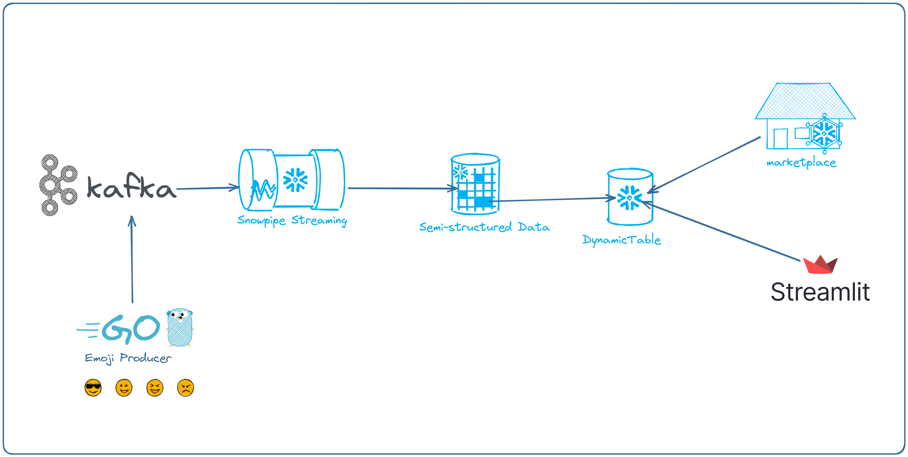

# Data Sharing Demo

## This is the repository for the Share Sharing Demo for the Perth STUG Build Event 2023-11-30

## What you'll build



#### What you'll need to setup the demo locally

- A Snowflake account [Get started for free](https://www.snowflake.com/en/)
- An instance of Kafka with the ability to setup Kafka Connect with the [Snowflake connector](https://docs.snowflake.com/en/user-guide/kafka-connector)

## Step 1 - Setup Kafka User and Schema

- Create the user account for the Kafka Connect user. _KAFKA_CONNECT_EMOJI_USER_
- [Generate the Key Pair for authentication](https://docs.snowflake.com/en/user-guide/kafka-connector-install#using-key-pair-authentication-key-rotation)
- Create the database and schema for Kafka Connect

```
Database: EMOJI
Schema: KAFKA_SCHEMA
```

- [Set the public key for the account](sql/kafka_connect/setup_public_key.sql)
- Follow the [instructions](https://docs.snowflake.com/en/user-guide/kafka-connector-install) to install the Snowflake Kafka Connect
- [SQL File to create the role.](sql/kafka_connect/setup_user.sql)
- Edit the [sample](sql/kafka_connect/config.json) Kafka Connect configuration file

## Step 2 - Activate the connector.

```
curl -X POST -H "Content-Type: application/json" --data @/tmp/config.json http://localhost:8083/connectors
```

- To remove the connector

```
curl -X DELETE http://localhost:8083/connectors/EmojiDesignsData
```

## Step 3 - Setup the sample data and generator

- An example go application is included in the go_src/generator folder
- It is configured to look for a URL and topic name via env vars

## Step 4 - Start the Generator

- Start the genrator application
- Check the log of the kafka-connect instance for any messages
- The default configuration will wait for 10,000 messages or 1 min
- Check the database table specified in the configuration has been created (EMOJI.KAFKA_SCHEMA.TABLE1 in the example configuration)

```
select * from EMOJI.KAFKA_SCHEMA.TABLE1
```

# Perth Suburb Demo

- Execute the SQL in [this](sql/suburbs/create_tables.sql) file

# Movies Emoji Demo

- Execute the SQL in [this](sql/movies/create_tables.sql) file
- [This] SQL is provided to load the [TheMovieDB](https://themoviedb.org) data.

NB An [example(go_src/tmdb_api_collector/main.go)] go application is included to extract the data for a supplied list of movies. You will need your own API key

## Streamlit App

- A sample streamlit app has been included
- This will show the Top 3 movies from the data table based on frequency
  

# Have Fun 😀
